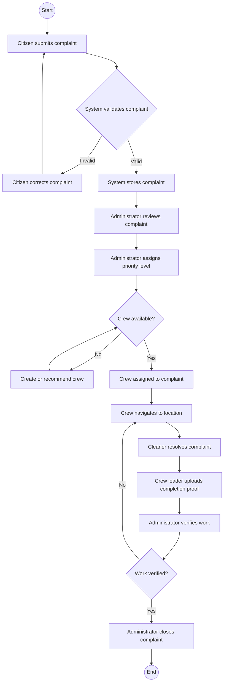
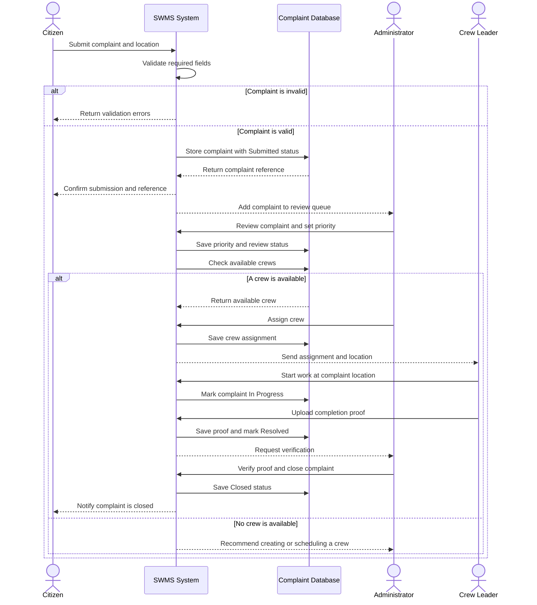

# Complaint Handling Process

## 4.3 Activity Diagram: Complaint Handling Process

Figure 4.2 - Activity Diagram of the Complaint Handling Process

## 4.4 Sequence Diagram: Complaint Submission and Crew Assignment

